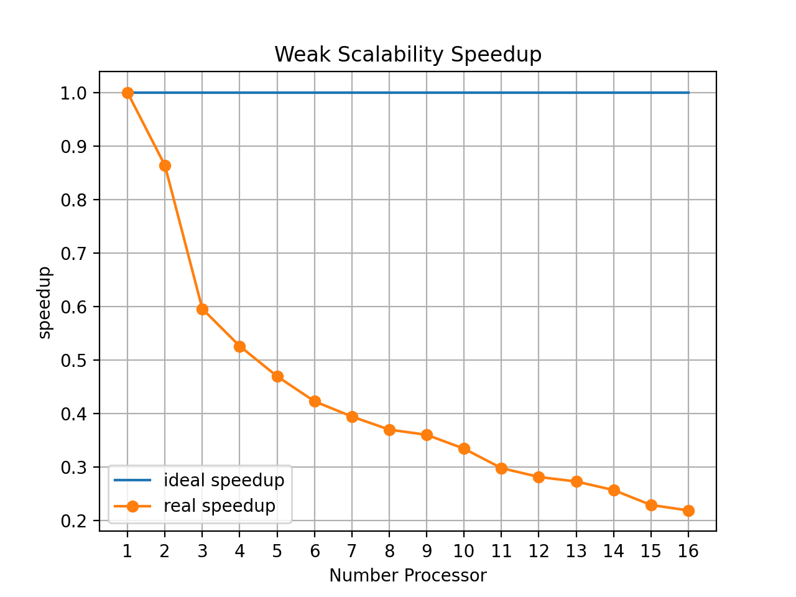

|Student|AWS Instace| Project|
|:---:|:---:|:---:|
|**Gerardo Gullo 0522501033** | m4.xlarge | Word Count|

## Index
<!--ts-->
   * [Introduction](#Introduction)
   * [Problem Statemen](#Problem-Statemen)
   * [Solution Approach](#Solution-Approach)
      * [Separators table](#Separators-table)
      * [How the virtual file works](#How-the-virtual-file-works)
      * [How Algorithm works (high level)](#How-Algorithm-works-(high-level))
   * [Implementation details](#Implementation-details)
   * [Execution instructions](#Execution-instructions)
   * [Correctness discussion](#Correctness-discussion)
      * [Example of execution](#Example-of-execution)
   * [Benchmarks](#Benchmarking)
      * [Strong Scalability](#Strong-Scalability)
      * [Weak Scalability](#Weak-Scalability)
<!--te-->

Introduction
============
This is a simple parallel implementation of words count using Open MPI developed in the context of Parallel, Concurrent and Cloud programming course at the University of Salerno.


Problem Statemen
================

We will be doing a version of map-reduce using MPI to perform word counting over a large number of files. There are 3 steps to this process:

1. is to read in the master file list which will contain the names of all the files that are to be counted. Note that only 1 of your processes should read this file. Then each of the processes should receive their portion of the file from the master process. Once a process has received its list of files to process, it should then read in each of the files and perform a word counting, keeping track of the frequency each word found in the files occurs. We will call the histogram produced the local histogram. This is similar to the map stage or map-reduce.
2. is to then combine frequencies of words across processes. For example the word 'cat' might be counted in multiple processes and we need to add up all these occurrences. This is similar to the reduce stage of map-reduce.
3. is to have each of the processes send their local histograms to the master process. The master process just needs to gather up all this information. Note that there will be duplicate words between processes. The master should then print out the results to the screen.

Solution Approach
=================
Before describing the solution algorithm, some **preliminary assumptions** must be carried out.
The algorithm considers a **byte** as **work unit**. So, each process recieves an equal amount of bytes and counts the words present in them.
To achieve a balanced workload among all the processes, a **preliminary stage**, described below, **of parrallel line counting is performed**.

Another preliminary assumption must be made: **each process can access to all the input files and make a *virtual single file* that contains all the words between the various files**. If the program is run in distributed memory, each node of the cluster must share the same directory structure and the same set of files.

Last but not least, **each computation step** described below **is performed both by the master and the slaves**. Operation made exclusively by the master are explicitly mentioned.
A word is considered as a sequence of alphanumeric symbols that are separate with a **separator** (you can see a separators table down below), so "*3D*", for example, is cosidered a word.

Separators table
----------------
Separator | 
:---:|
`\n` |
`space` |
`\n\r` |
`,` |
`.` |
`:` |
`;` |
`\t` |
`(` |
`)` |
`"` |
`?` |
`!` |

How the virtual file works
--------------------------

Each processor reads all the files inside the folder, and in alphanumeric order, loads an element of the `MyFile` structure into an array.
MyFile is made up of simple attributes.
```c
   struct MyFile{
    char name[FILENAME_SIZE]; //file name
    long file_size; //file size
    long index; //attribute usefull for virtual file
   }
```
The `index` attribute allows the creation of the virtual array.
It is calculated as the sum of the size of the previous files. Through this index it is possible to work on several files as if it were one.

For example we have 3 files:

name|size (bytes)|
:---:|:---:|
`a.txt` | 3000 |
`b.txt` | 6000 |
`c.txt` | 1000 |

we will have an array with the 3 elements:

0. `{name: "a.txt", size: 3000, index: 0}`
1. `{name: "b.txt", size: 6000, index: 3000}`
2. `{name: "c.txt", size: 1000, index: 9000}`

If a processor is required to read bytes 2000 to 3000, doing a binary search will find the file `a.txt`. On the other hand, if a processor has to read bytes from 8000 to 10,000, with a light binary search from bytes 5000 to 6000 from the `b.txt` file and the remaining 1000 from the `c.txt` file.

This allows each processor to work as if it were a single file. Thanks to this abstraction, a job (job per processor) can be defined as two integers that indicate the beginning and the end of the block of bytes to be processed.

How Algorithm works (high level)
------------------
1. The master process recieves from CLI a directory path that contains files in which are written all the words need to be counted.

2. Every processor read every file in directory path and make a virtual single file that containes all of files.

3. the master assigns a job for each processor (even for itself), dividing the size of all files by the number of processors. Knowing the size of the block of bytes, it assigns each processor its relative block, checking by dynamically accessing the end of that block, verifying that no words are truncated. For example, if a block truncates the last word, the master will notice this and enlarge the block assigned to that relative processor. This check allows not to have truncated parore between the various byte blocks. In addition, each master each job also calculates additional information such as the position of the first and last file in the virtual file array.

4. Each process counts the words occurrences in the lines present in the byte block using an `hashmap`. 

5. The computed occurrences are sent to the master which merges the partial results and save the data in alphabetical order in a csv file.

Execution instructions
======================

Setup
-----
```bash
mkdir out
mkdir files
```

Compile
-------
```bash
make 
```
**🛠️ There are some flags that can help you in debugging and benchmarking reporting.**

Send to the hitter the following directives `BENCHMARK` to activate the performance log and `DEBUG` for the debug logs.

Example to enable **both**:
```bash
mpicc -D DEBUG -D BENCHMARK -o ./out/wordcount hashmap.c wordcount.c
```

Run
---
**⚠️ Before run the command below put some file in files folder.**
```bash
mpirun -np $numberofinstances --hostfile hostfile ./out/wordcount $filesdirectory
```
or 
```bash
make run
```
to clean possible previously compiled versions use
```bash
make clean
```

Correctness discussion
======================
The algorithm divides the input files trying to provide a portion as balanced as possible between the various processors available.
All processors will load into memory the information useful for creating a virtual file.
The master process will divide by the total size of the file to identify the optimal size of the block of bytes to be analyzed by each process, the block could undergo variations in size in two cases:
1. At the end of the block there is a truncated word, in this case the master will increase the size of the block to include the word in question.
2. The buffer exceeds the size of the virtual file, in this case the master reduces the size of the buffer to match the two sizes.

In the first case, the verification takes place by dynamically accessing the file (the position of the file in the array is through a binary search algorithm to optimize performance) and dynamically accesses the end of the block by moving the filepointer thanks to the `seek` function. After that, again for performance reasons, it moves a portion of the file in a buffer starting from the end point of the block. Finally, the part of checking the truncation ends by identifying the first position of a separator and widening the block up to the position of the separator.

Obviously in the computations of the next blocks we will start from the end point of the previous block.

Once the blocks to be analyzed are computed, the master will send each job to each process through a `Scatter`.
Each job contains the index of start and end of the block in the virtual file and the indexes of the first and last file that are inside that block.

Each process that has received its job will allocate the buffer it needs to read the whole block and will load the data by reading from the files. If the block is between two or more files it will add a separator between the end and the beginning of the other, preventing the last and the first word of the next file from merging.

Once the buffer has been filled up, it is used as a parameter to the `strtok` function which allows us to iterate over the words found between the seperators and then will be inserted into a hashmap as an element of the `Word` structure.

Once this step is completed, all key-value pairs of the hashmap are transformed into an array and sent to the master.

The master will receive according to the order of receipt of the message. Using the `Iprobe` function it computes the size of the payload and changes the size of its buffer if needed through a realloc. Having received the data, it adds them to its hashmap and completes the execution by saving a csv in alphabetical order of the word and frequency pairs.

Example of execution
--------------------
We will use for this execution **3 processors** and **two files** found in the `other_files/` directory that is '1000_lorem.txt' and '1000_lorem_2.txt'.

Each process will create its own virtual file thus composed.

`[{name: 10000_lorem.txt, file_size : 68038,index: 0},{name: 10000_lorem_2.txt, file_size : 68038,index: 68038}]`

So the size of the virtual file is 136076 bytes,therefore 45359 bytes for each process, since 136076 is not divisible by 3, **one byte is added to the buffer size at all**.

The master will calculate each job using 45359 as the initial size and then adding the padding size for each one.

The first process will have 2-character padding since its block ends with this string "...enim, eget laore`|`et`\`arcu lectus ac eros..." (The `|` symbol indicates where ended its block before padding and `\` after padding).

So processor 0 will start at 0 and finish 45361.

The second process will have 6-character padding since its block ends with this string "...Praesent ultrices malesuada con`|`vallis`\`..."

The third and final process will have a -9 character padding. Since its block initially ended at 136085 but since it exceeds the size of the virtual file (136076) its buffer will be reduced to match the two sizes.

The master, once the jobs have been sent to all processors, will fill their buffers with file data.

Processor 0 reads bytes 0 to 45361 found in the first file.

Processor 1 reads bytes 45361 to 90726 which is between the first file and the second file.

Processor 2 reads bytes 90726 to 136076 which is between the first file and the second file.

Once the word frequency has been calculated they will send the contents of their hashmap to the terminado Master process.

The Master will add all this information to his hashmap and print his report. Reporting that the total words are 2000.

**If you want to restart this execution just recompile in debug, add only the two files in the directory and send the following command.**

```bash
mpirun -np 3 ./out/wordcount ./files/
```

It will save in the project root the data read in each buffer and the result of the computation.

Implementation details
======================

Thanks for the implementation of the **hashmap** that can be retrieved at this [repo]( https://github.com/tidwall/hashmap.c).

To allow easier communication, structures such as **MPI Datatypes** have been defined. That is the `Word` and `Job` structure.


This solution has been developed using  `Scatter` to send one job to everyone, `Iprobe` and `Recv` communication routines to receive from each process in order of completion, by calculating the size of the payload being received. The execution time is computed using the `Wtime` function.

Benchmarking
============

The solution has been tested over a cluster of 4 AWS EC2 m4.xlarge (4 virtual processor, 16 GB RAM) Ubuntu instances using the files inside the `files/` folder as input. Here are reported the results in terms of **Weak** and **Strong Scalability**,  which means using an increasing number of processors over a fixed input and using an increasing number of processors with the load-per-processor fixed respectively. Reported data are a mean of several executions. In a further section will be explained how to reproduce results. 

**All the benchmarks were repeated several times, the results reported are an average of all the executions carried out. Raw data can be viewed [here](./benchmarks/benchmark.txt).**

Strong Scalability
------------------
Here are reported data for strong scalability test. Input size is **992730000 bytes** (992.73 MB). 
The **Strong Scaling Efficency** is computed using the following formula: 

`t(1) \ (N * t(N))`

where t(1) is the execution time with one processor, N is the number of processors and t(N) the execution time with N processors.

The **Speedup** is computed using the following formula: 

`t(1) \ t(N)`

where t(1) is the execution time with one processor, N is the number of processors and t(N) the execution time with N processors.

| N of Processors|Execution Time (Sec)| Strong Scaling Efficency (%)| Speedup
|:---:|:---:|:---:|:---:|
1|34.61|100.0|1.0
2|18.02|96.05|1.92
3|17.09|67.5|2.02
4|13.58|63.72|2.55
5|11.11|62.29|3.11
6|9.83|58.66|3.52
7|8.85|55.84|3.91
8|8.19|52.79|4.22
9|7.83|49.1|4.42
10|7.5|46.14|4.61
11|7.37|42.69|4.7
12|7.43|38.84|4.66
13|7.4|35.98|4.68
14|7.5|32.95|4.61
15|7.76|29.73|4.46
16|7.9|27.37|4.38


The tests show that the more processes are used, the less time is needed to complete the task. However, as the number of processors goes above 10, the execution time reduction decreases, assesting on about 7,8 seconds. This means that above 10 processors, the gained speedup is low.

Weak Scalability
----------------

Here are reported data for weak scalability test. Input per process ratio is 33091001:1 (33.091001MB:1). The **Weak Scaling Efficency** is computed using the following formula: 

t(1)/t(N)

where t(1) is the execution time with one processor and t(N) the execution time with N processors.

|Processors|Execution Times|Weak Scaling Efficiency| Problem Size
|:---:|:---:|:---:|:---:|
1|1.45|1.0|33091001
2|1.68|0.86|66182002
3|2.43|0.6|99273003
4|2.75|0.53|132364004
5|3.08|0.47|165455005
6|3.42|0.42|198546006
7|3.67|0.39|231637007
8|3.91|0.37|264728008
9|4.01|0.36|297819009
10|4.32|0.33|330910010
11|4.85|0.3|364001011
12|5.13|0.28|397092012
13|5.29|0.27|430183013
14|5.62|0.26|463274014
15|6.31|0.23|496365015
16|6.6|0.22|529456016




As data shows, effincency constantly decrease as the number of processors rises.

Results Interpretation
----------------------
As the tests results show, the proposed solution does not scale very well. In particoular, the efficency drop can be seen when the processors used are more than 8.

This is also due to the fact that the size of the problem with which the benchmarks were not performed are not very large in case we start to have more than 8 processors. In fact, as we can see by increasing the resources too much, the execution times start to drop due to the overhead generated by the exchange of messages.

How to Reproduce Test Results
-----------------------------
To reproduce the same results on the aws cluster it is necessary to allocate 4 m4.xlarge nodes and use 60 copies of `other_files/merged_file.txt` for strong scalability instead for weak scalability one copy for each processor used in the execution of `other_files /merged_file_2times.txt`.

If you are testing locally, you can simply use the following command:

```bash
make benchmark
```

**⚠️Be careful the `files` folder must be empty before this command.**
